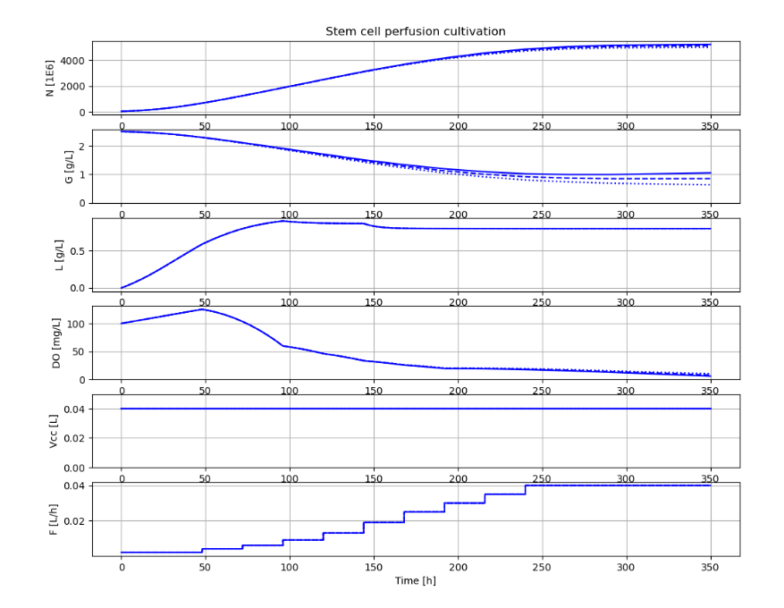

# BPL_STEM_AIR_Perfusion

This exampe show simulations of stem cell cultivation in an aerated hollow fiber reactor. The reactor volume is kept constant and cells recycled, thus the setup is similar to perfusion cultivation. The model combines rudimentary cell growth and metabolism combined with times series data of of the metabolic rates: qNmax, qLc, and qO2.

You see in the diagram typical curves for cell growth, glucose, lactate and also dissolved oxygen during perfusion cultivation.

You start up the notebook in Colab by pressing here
[start BPL notebook]
(https://colab.research.google.com/github/janpeter19/BPL_STEM_AIR_Perfusion/blob/main/BPL_STEM_AIR_Perfusion_colab.ipynb)
Then you in the menu choose Runtime/Run all. If you have chosen the altarnative with FMPy click first on the symbol Open in Colab. The subsequent execution of the simulations of STEM cell cultivation take just a second or so. 

You can continue in the notebook and make new simulations and follow the examples given. Here are many things to explore!

Note that:
* The script occassionaly get stuck during installation. Then just close the notebook and start from scratch.
* Remember, you need to have a google-account!

Just to be clear, no installation is done at your local computer.

Work in progress - stay tuned!

License information:
* The binary-file with extension FMU is shared under the permissive MIT-license
* The other files are shared under the GPL 3.0 license
